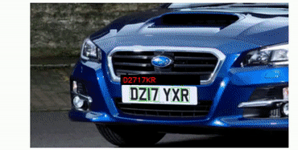

# Real-time Car Plate Detection And Recognition 🚗🔍

Welcome to a state-of-the-art project focused on detecting and recognizing car plates in real-time!

## Overview

This project aims to deliver a comprehensive solution for the real-time detection and recognition of vehicle license plates. By dividing the problem into specific modules and leveraging advanced algorithms, the system can accurately and rapidly process input images to provide precise outputs.

## Problem Breakdown

The challenge can be dissected into three main components:

1. **Car Plate Detection**: 
   - Utilize advanced computer vision algorithms, primarily the YOLO (You Only Look Once) framework, to detect car plates.
   - Efficiently draw bounding boxes around the identified license plates.

2. **Image Cropping**:
   - Once the license plate is detected, extract or crop the image specifically around the license plate area to prepare it for character recognition.

3. **Character Recognition**: 
   - Develop a robust character recognition model.
   - Recognize and interpret characters on the license plate using the power of YOLO.
   
**Note**: YOLO was chosen for this task because it's widely considered the SOTA in object detection, delivering unparalleled speed and accuracy.

## Model Development

1. **YOLOv8 Adoption**: 
   - Implement the latest version of YOLO: YOLOv8, from Ultralytics, ensuring access to recent advancements and optimizations.

2. **Dataset Preparation**: 
   - Structure the license plates dataset in alignment with the requirements of the chosen algorithm.
     
     

3. **Model Training**: 
   - Train the model specifically for plate detection, ensuring it is attuned to diverse license plates' intricacies.

4. **Model Preservation**: 
   - After achieving satisfactory performance, save the model weights for both plate detection and character recognition.

5. **Character Recognition**: 
   - Once the license plate is cropped from the main image, process it with the character recognition model.

6. **Output Presentation**: 
   - Translate the model's findings into a coherent license plate text, delivering the final output.

---

Embark on this journey through the codebase, explore each module, and witness the power of modern computer vision in action!
